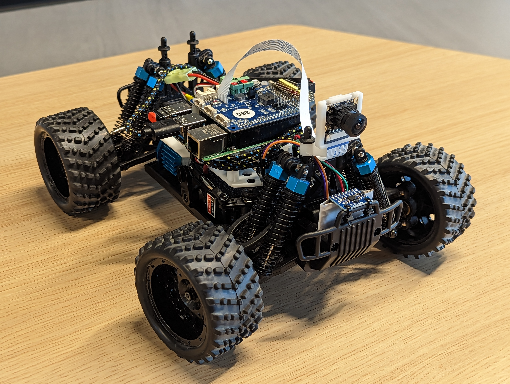
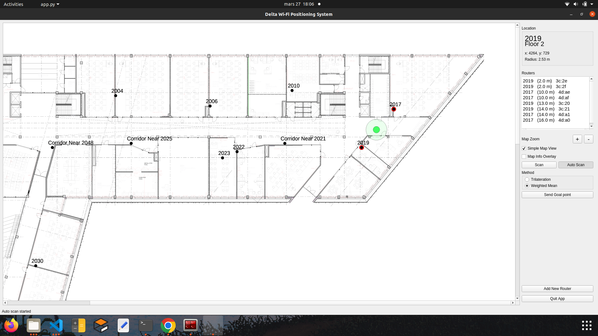
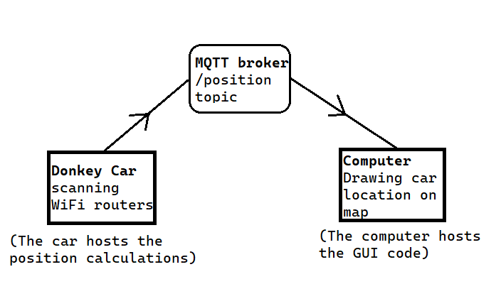

# Blog
Here is the full blog of this project where we display our research and experiments.

## The Donkey Car

Donkey Car is an open source, DIY self-driving platform. It focuses on providing enthusiasts and students with all the tools to experiment with deep learning, object detection and autonomous driving. Thanks to libraries like TensorFlow, Keras, OpenCV, users can train their own self driving model, based on imitation learning for instance, and within hours they can obtain a working autonomous vehicle, capable of taking corners and avoiding obstacles.

The Donkey Car can be bought as a full kit, or assembled by the user with 3D printed parts and some electronics like the Raspberry Pi 4, Robot Hat MM1, servos...

The full project is accessible and very well documented online.

## Setting up the car

For this project, we are working with the Donkey Car number 124. The car was used previously by other students, but we decided to flash a brand new image on the SD Card just to be sure we can start from scratch and tailor our environment for our project.

This setup is rather straightforward since Donkey Car provides a very step by step documentation on their website: http://docs.donkeycar.com

A small hiccup during the setup of the Raspberry Pi was that we misunderstood the network setting template and left some "<>" in the SSID and password definitions. It took us some time to figure out the mistake and without a working connection between the Pi and the router, we were not able to SSH into the car and perform further setup.

## Indoor localization 

Indoor localization poses a significant challenge as conventional tools such as GPS are not reliable in buildings. As a result, our project turned to WIFI localization as a potential solution. We discovered a project developed by a bachelor's student from Tartu University that utilized WIFI signals for positioning. You can find the code on his GitHub repository: https://github.com/tonysln/delta-wifi-pos.

This code uses the RSSI of various WIFI routers in the surrounding area to approximate the location of the device. For the interface, it uses Qt framework to show the interactive map with the user location.

We decided to start from this code and make modifications. We adapted the code to suit our application.

This is what the interface of the original code looks like :

The image represents the second floor of the Delta building of Tartu university. Our current location is represented by the green point, which has been determined by our code, and the circle surrounding it is proportional to the uncertainty of our location.
We estimates the inaccuracy to be from 2 to 5 meters from our real position.

This first test is localizing our computer hosting the app. However, we want everything to run on the Donkey Car. So we went ahead and installed the full repository on the Raspberry Pi, but unfortunately, the package *Pyside6* which is responsible for the GUI and map of the Delta building cannot be installed on the single board computer (We thought we'd access the GUI running on the car via SSH with an -X argument). A workaround we came up with is installing an MQTT broker on the Pi, and sending the car's position as MQTT messages which a distant computer can grasp and place on the map. This way, the car can determine its position with respect to the routers, use it to navigate, and on our computer we're able to track the said position on the map. While we were at it, we also installed Node-RED on the Pi to take advantage of the MQTT receiver tool and debugging console.

The schematic below breaks down this process in case this explanation was not clear enough:

Here is a video of us trying to locate the car on the computer, while we drive it manually:

With this method we can retrieve the car's location from the server and display it on the map, but there is a significant delay between the actual position of the car and the position shown on the map.The delay is likely caused by the time required for the code to scan all available routers and calculate the location approximation. This delay, combined with the imprecision, creates significant challenges in maintaining accurate real-time tracking of the car when driving autonomously.
