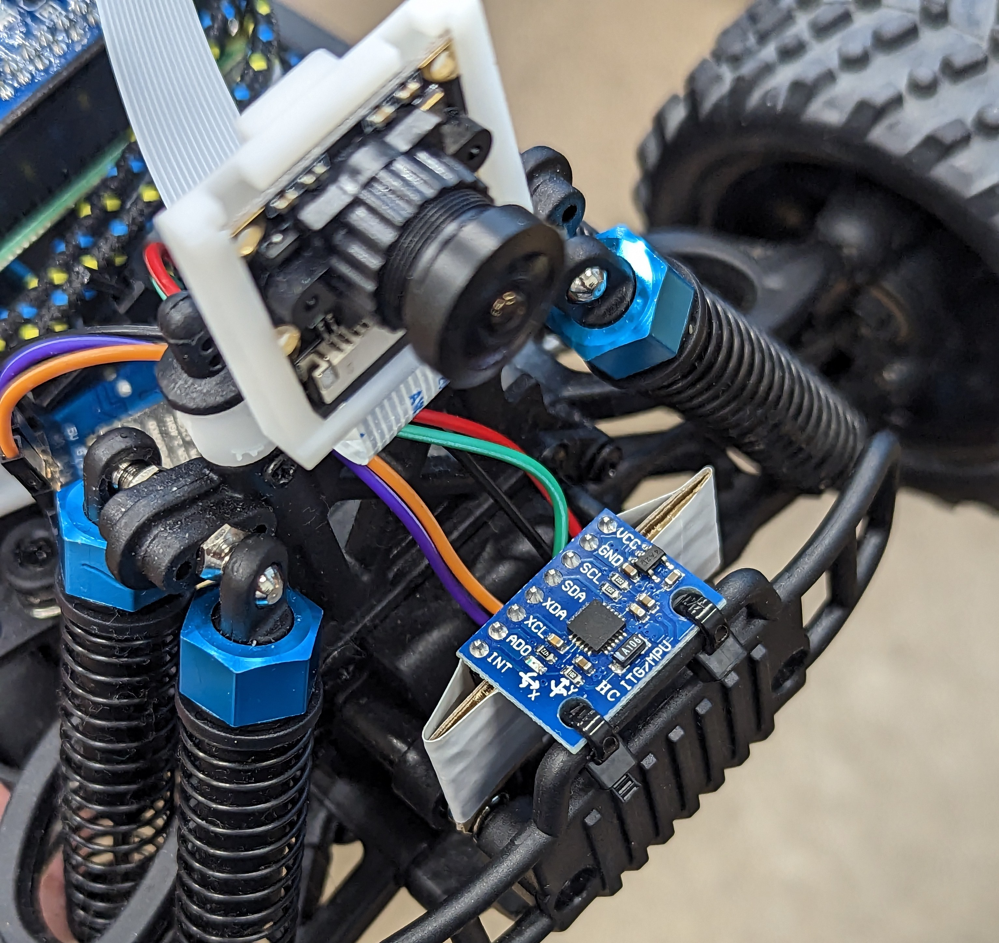

# Blog
Here is the full blog of this project where we display our research and experiments.

## The Donkey Car
<p align="center">

</p>

Donkey Car is an open source, DIY self-driving platform. It focuses on providing enthusiasts and students with all the tools to experiment with deep learning, object detection and autonomous driving. Thanks to libraries like TensorFlow, Keras, OpenCV, users can train their own self driving model, based on imitation learning for instance, and within hours they can obtain a working autonomous vehicle, capable of taking corners and avoiding obstacles.

The Donkey Car can be bought as a full kit, or assembled by the user with 3D printed parts and some electronics like the Raspberry Pi 4, Robot Hat MM1, servos...

The full project is accessible and very well documented online.

## Setting up the car

For this project, we started working with the Donkey Car number 124. The car was used previously by other students, but we decided to flash a brand new image on the SD Card just to be sure we can start from scratch and tailor our environment for our project.

**However, the steering angle of the car was terrible and we ended up not being able to access the car at all (corrupted OS, broken hardware...?). For that reason we were given the car number 260 instead. This new car worked flawlessly for the rest of the project.**

This setup is rather straightforward since Donkey Car provides a very step by step documentation on their website: http://docs.donkeycar.com

A small hiccup during the setup of the Raspberry Pi was that we misunderstood the network setting template and left some "<>" in the SSID and password definitions. It took us some time to figure out the mistake and without a working connection between the Pi and the router, we were not able to SSH into the car and perform further setup.

Our car being the number 260, we went with the hostname ```donkey-260```. So the car can be accessed through SSH like so:

```
ssh pi@donkey-260.local
```

Using a hostname makes things so much easier. On a small network, finding the IP associated with the car from the router's interface is doable, but on the university's network it's absolutely impossible. 

**Note:** our car is locked with a password so no one can access it while it's running via SSH. This doesn't prevent anyone from altering our SD card physically when the car is stored in its box of course...

## Calibrating the car

Once the car is setup and can be accessed via SSH, it can technically drive, but its direction must be calibrated to make sure it drives straight. To do so, there are two ways:

1. Using the command line, playing with different PWM values until we found one that's satisfying.

This method did not work for us, as it is complicated to understand which GPIO pin is used by the board to steer, and how to call it in the command.

2. Using the mobile app and installing all the necessary server software on the car.

This method worked so easily for us we almost regretted wasting time on the first method. The Donkey Car documentation breaks down the steps on how to setup the mobile app (client) and software (server) on the car.

http://docs.donkeycar.com/guide/deep_learning/mobile_app/

For the mobile app to detect the car (obviously connected on the same WiFi network), the server must be running on the car. To do so, here are some commands to be executed in the car via SSH:

```
cd /opt/donkeycar-console
python manage.py runserver 0.0.0.0:8000
```

From the app it's important to calibrate the steering but **ALSO** the throttle. We had a bad surprise and the car zoomed across the room breaking the camera mount. The car should lifted off the ground and the throttle PWM should be calibrated (reduced/increased) so that the car's wheels spin at a reasonable speed when the speed multiplier set by the controller is high.

## Driving the car

When the car is calibrated, we can actually start driving. Again, the Donkey Car documentation makes it really straight forward. Here are some commands to start driving the car:

```
cd ~/mycar
python manage.py drive --js
```

Note that the ``` --js ``` argument specifies that we want to drive with the controller that's chosen in the myconfig.py file! In our case we use the Logitech F710.

Pressing the **START** button until the terminal says "user" we set the car so that it expects thumbsticks input for throttle and steering. The car should move if the speed multiplier is set high enough with the D-pad's up and down buttons!

## Indoor localization 

Indoor localization poses a significant challenge as conventional tools such as GPS are not reliable in buildings. As a result, our project turned to WIFI localization as a potential solution. We discovered a project developed by a bachelor's student from Tartu University that utilized WIFI signals for positioning. You can find the code on his GitHub repository: https://github.com/tonysln/delta-wifi-pos.

This code uses the RSSI of various WIFI routers in the surrounding area to approximate the location of the device. For the interface, it uses Qt framework to show the interactive map with the user location.

We decided to start from this code and make modifications. We adapted the code to suit our application.

This is what the interface of the original code looks like :

<p align="center">

</p>

The image represents the second floor of the Delta building of Tartu university. Our current location is represented by the green point, which has been determined by our code, and the circle surrounding it is proportional to the uncertainty of our location.
We estimates the inaccuracy to be from 2 to 5 meters from our real position.

This first test is localizing our computer hosting the app. However, we want everything to run on the Donkey Car. So we went ahead and installed the full repository on the Raspberry Pi, but unfortunately, the package *Pyside6* which is responsible for the GUI and map of the Delta building cannot be installed on the single board computer (We thought we'd access the GUI running on the car via SSH with an -X argument). A workaround we came up with is installing an MQTT broker on the Pi, and sending the car's position as MQTT messages which a distant computer can grasp and place on the map. This way, the car can determine its position with respect to the routers, use it to navigate, and on our computer we're able to track the said position on the map. While we were at it, we also installed Node-RED on the Pi to take advantage of the MQTT receiver tool and debugging console.

The schematic below breaks down this process in case this explanation was not clear enough:

<p align="center">

</p>

Here is a video of us trying to locate the car on the computer, while we drive it manually:

https://www.youtube.com/watch?v=ZmvoQWlBWLI


With this method we can retrieve the car's location from the server and display it on the map, but there is a significant delay between the actual position of the car and the position shown on the map.The delay is likely caused by the time required for the code to scan all available routers and calculate the location approximation. This delay, combined with the imprecision, creates significant challenges in maintaining accurate real-time tracking of the car when driving autonomously.

## IMU

Having a way to localize the car at hand, we then needed to measure the car's heading so that we could implement some path planning from the vehicle's current location to a goal point (in other words we wanted the car to have its own compass). The MM1 Hat that is installed on the car has a MPU9250, an IMU (Inertial Measurement Unit) composed of a gyroscope, accelerometer and a complementary magnetometer. We tried to take advantage of this sensor using the very famous i2cdevlib module for Python developed by J. Rowberg (https://github.com/jrowberg/i2cdevlib) but the sensor is wired onto the board in a way that makes it difficult to use. Instead, we used our own MPU6050 IMU which is a downgraded version of the MPU9250 without the magnetometer.

The issue with the lack of magnetometer is that we needed to implement a compass for the car, and using the accelerometer/gyroscope combo alone can only do the trick to some extent. Z-drift is very noticeable overtime but thankfully J.Rowberg thought about it and an interrupt pin on the MPU6050 coupled with a DMP (Digital Motion Processor) embedded on the sensor allows some digital filtering and the drift is significantly attenuated.

<p align="center">

</p>

We mounted the MPU6050 at the front of the Donkey Car, and the sensor itself is connected to a Wemos D1 mini (ESP8266) micro-controller (MCU). The MCU reads the IMU and sends the Z rotation as Euler angle through Serial (USB). Then we have a python script that reads the Serial port on the Raspberry Pi and extracts the Z orientation. From there we can process the value and use it for navigation.

<p align="center">

</p>

**Note:** Since we do not use a magnetometer, which in essence can tell the North orientation. We added some calibration step in the IMU start up code to calibrate the orientation with an external compass (on a mobile app for instance). The car needs to be placed on a flat surface, oriented with its front facing the North and the Reset button on the D1 mini should be pressed once. The calibration takes roughly 30 seconds.


## Trainning a model

To train our model, we attempted to use the computer's GPU by following the instructions in the Donkey Car documentation. After numerous hours of installation, deletion, and reinstallation of different versions, we finally succeeded in getting the GPU to work. However, the training process was still problematic - it took a long time to start and would stop or crash after a few epochs. At first, we thought that it might be due to corrupted data. So, we tried different configurations, such as changing the resolution of the images, but we still couldn't get it to work. We also tried reducing the number of parameters of the model to lessen the GPU's load. Finally, what worked for us was setting IMAGE_H to 128 and training the model on the CPU instead of the GPU. Initially, we had kept the default IMAGE_H value of 120, but a warning message indicated that it would be automatically adjusted to 128 because 120 was not feasible. To ensure that we had control over this variable, we manually defined IMAGE_H as 128.

Once we could train the model, the next challenge was to make it perform well. To achieve the desired results, we had to overfit the model to the specific use case. For example, if we wanted to train the model to drive the car straight until it reached an intersection, and then turn left or continue straight based on high-level commands, we had to use the exact same intersection for both training and testing. If we tested the same model on a different intersection, it would not work. This limitation was primarily due to the amount of training data we used. By increasing the quantity of data, we could potentially generalize the model to multiple intersections. However, our immediate goal was to test whether the high-level command would work with the model so that we could move forward and try the same approach with localization.

## Hardware troubles